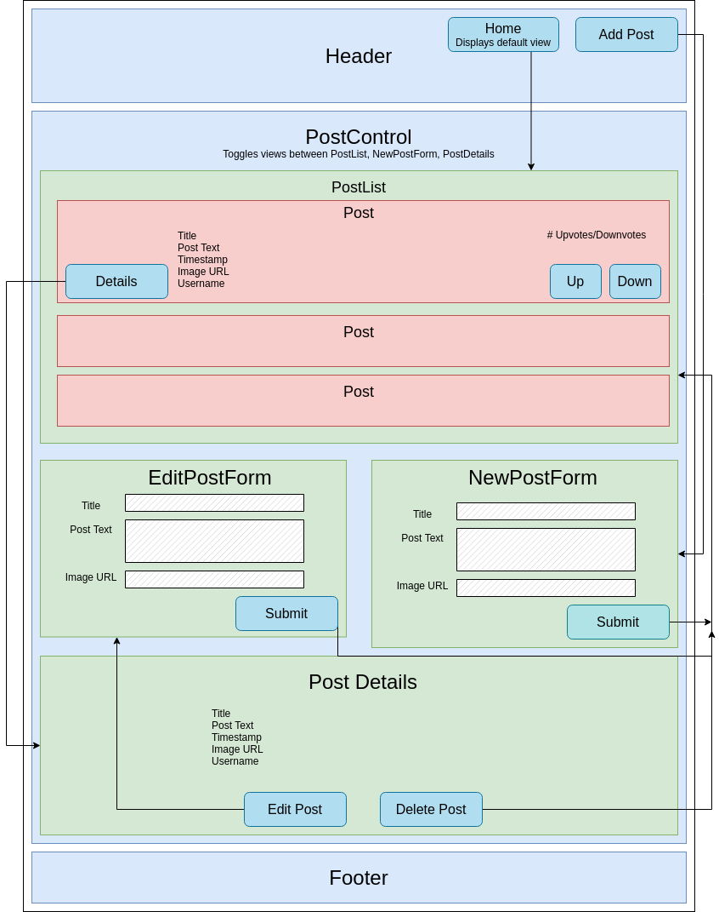

# Discussion Forum

#### React & Redux Exercise for [Epicodus](https://www.epicodus.com/), 04.28.2020

#### By **Adela Darmansyah, Tiffany Siu, Andriy Veremyeyev**

[About](#About) | [User Stories](#User-Stories) | [Component Diagram](##React-Component-Diagram) | [Screenshots](#Screenshots) | [Installation](#Installation-Instructions) | [Bugs](#Known-Bugs) | [Technologies](#Technologies-Used) | [Contact](#Support-and-Contact-Details)

   

## About

**Inspired by sites like Reddit and HackerNews, this web application is a discussion forum that allows users to post news, pictures and other info around a certain topic.** Other users can then upvote or downvote content. The more upvotes an item receives, the higher it's displayed on the list.

## User Stories

* As a user, I want to enter content into a form and submit to create a new post.
* As a user, I want my new posts to include a timestamp. And I want to see when other listings were posted, too.
* As a user, I want to upvote posts I particularly enjoy.
* As a user, I want to downvote posts I don't like, or find inappropriate.
* As a user, I'd like posts with the most upvotes to appear higher on the page.
<!-- (We haven't explicitly covered this in our curriculum, but here's a hint: You can complete logic before the return statement of a mapStateToProps() method!) -->

## React Component Diagram

  

## Screenshots

<!--  -->

## Installation Instructions

* Clone this repository.

* Open the `Command Line Interface` and enter the following:
  * `cd discussion-forum` to navigate into the repository.
  * `npm install` to install all necessary plug-ins.
  * `npm start` to start the application.

## Known Bugs

No known bugs at this time.

## Technologies Used

* HTML
* CSS
* JavaScript
* React
* Draw.io
* Markdown
* _npm*_

_*Check out `package.json` file to see the complete list of all plug-ins._

## Support and Contact Details

Feel free to provide feedback via email: adela.yohana@gmail.com, tsiu88@gmail.com, or belyybrat@gmail.com.

### License

This application is licensed under the MIT license.

Copyright (c) 2020 **Adela Darmansyah, Tiffany Siu, Andriy Veremyeyev**
